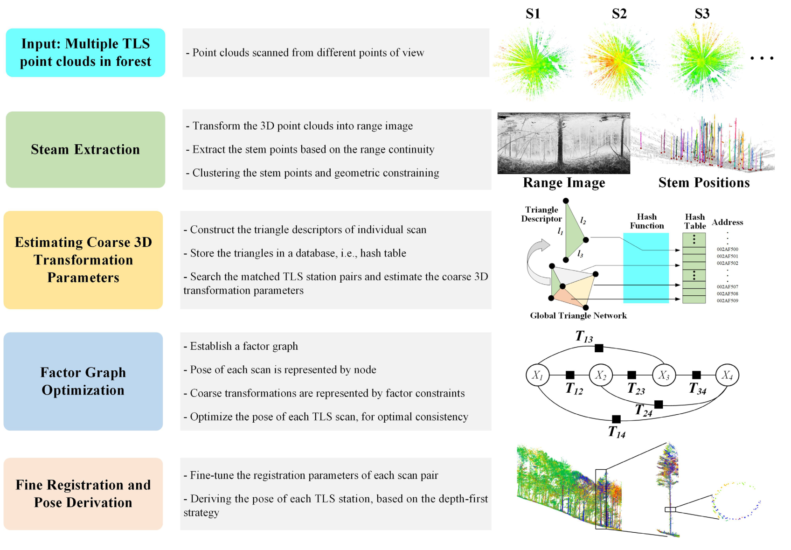
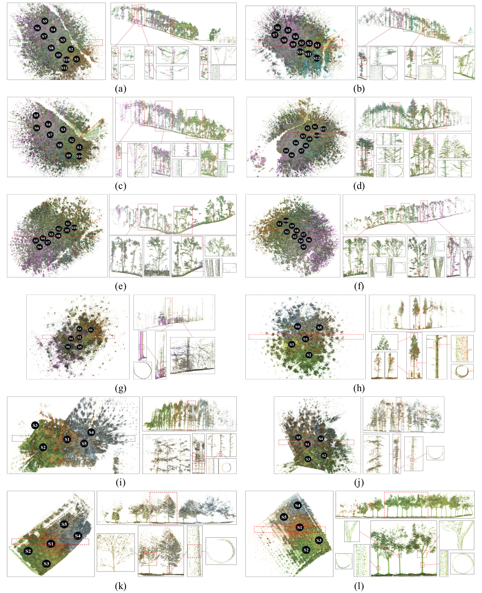

[](README.md) [](README.zh.md)

# :deciduous_tree: HashReg
森林环境中的多站TLS扫描自动化配准: 一种基于哈希表的端到端方案

## :bulb: 引言
地面激光扫描（TLS）因其精确、非接触记录三维空间结构的能力，被证明是森林资源清查的常用工具之一。TLS的多站扫描能够实现多角度的数据采集，但每站扫描的点云在各自的坐标系，需要转换到统一坐标系。实际应用中，最常见的解决方案是在野外人工放置人工标志，这种方法耗时费力。因此，自动化多站扫描配准方法对后续应用极具价值。本研究提出一种针对森林点云的自动化TLS多站扫描配准算法HashReg，该算法利用了哈希表的高效操作特性，能够在无需任何输入的前提下实现多站TLS点云的高效配准。



## :bulb: 样例
下图中多站扫描获取的点云以不同颜色表示，并转换至统一坐标系，扫描位置由一系列黑色圆圈标记。

为更清晰地展示每块样地的内部细节，红色虚线框标记的区域被提取并展示为剖面图，显示在子图的右上角。此外，随机选取部分树木进行放大，以展示配准效果。树干、树枝乃至冠层结构的细节特写，放在各子图的右下角。



***
:point_right::point_right::point_right: : **如果你对HashReg算法感兴趣且想在自己的数据上进行测试，这里是一份快速上手的操作手册**

## 快速开始
### :package: 环境依赖
该代码已在 Ubuntu 18.04 系统上通过测试，依赖的第三方库如下：

> PCL >=1.10 (use 1.12 in this project)

> libLAS (1.8.1)

> Eigen >=3.3.4

> OpenCV >=3.3.1

> CSF (Cloth Simulation Filter)

> small_gicp

> GTSAM

> OpenMP

### 安装PCL库 (本项目使用版本为1.12)

若需在 Ubuntu 18.04 中安装1.12新版本，您可以通过源码编译安装 PCL（Point Cloud Library）：
访问[https://github.com/PointCloudLibrary/pcl](https://github.com/PointCloudLibrary/pcl) 获取源代码并编译。

**注意：请将 PCL 1.12 安装到与系统默认的 PCL 1.8 不同的路径下，以避免版本冲突。**


#### 安装 liblas 库


可通过访问 [下载页面](https://liblas.org/download.html#download) 或 [GitHub 代码库](https://github.com/libLAS/libLAS) 获取 libLAS 的源代码。  

之后：
``` bash
cd liblas or your souce-code-path
mkdir makefiles
cd makefiles
```

配置基础核心库以支持“Unix Makefiles”编译目标：

``` bash
cmake -G "Unix Makefiles" ../
-- The C compiler identification is GNU
-- The CXX compiler identification is GNU
-- Checking whether C compiler has -isysroot
-- Checking whether C compiler has -isysroot - yes
-- Check for working C compiler: /usr/bin/gcc
-- Check for working C compiler: /usr/bin/gcc -- works
-- Detecting C compiler ABI info
-- Detecting C compiler ABI info - done
-- Checking whether CXX compiler has -isysroot
-- Checking whether CXX compiler has -isysroot - yes
-- Check for working CXX compiler: /usr/bin/c++
-- Check for working CXX compiler: /usr/bin/c++ -- works
-- Detecting CXX compiler ABI info
-- Detecting CXX compiler ABI info - done
-- Enable libLAS utilities to build - done
-- Configuring done
-- Generating done
-- Build files have been written to: /Users/hobu/hg/liblas-cmake/makefiles
```

编译源代码，并安装

``` bash
make
sudo make install
```

最后，运行lasinfo命令来测试liblas是否安装成功
``` bash
lasinfo Path_To_Your_Data/XXX.las
```

如果安装成功，在你的terminal窗口中应该能看到类似于下面的情况

``` bash
---------------------------------------------------------
  Header Summary
---------------------------------------------------------

  Version:                     1.2
  Source ID:                   0
  Reserved:                    0
  Project ID/GUID:             '00000000-0000-0000-0000-000000000000'
  System ID:                   'libLAS'
  Generating Software:         'libLAS 1.8.1'
  File Creation Day/Year:      230/2024
  Header Byte Size             227
  Data Offset:                 227
  Header Padding:              0
  Number Var. Length Records:  None
  Point Data Format:           3
  Number of Point Records:     21433359
  Compressed:                  False
  Number of Points by Return:  0 0 0 0 0 
  ```

#### 安装 Eigen 库
你可以通过apt的方式来安装 Eigen 库
``` bash
sudo apt update
sudo apt-get install libeigen3-dev
```
或者你可以通过此链接直接下载源码:
[https://eigen.tuxfamily.org/index.php?title=Main_Page](https://eigen.tuxfamily.org/index.php?title=Main_Page)

#### 安装 OpenCV 3.3.1
你可以通过apt的方式来安装 OpenCV 库 

``` bash
sudo apt update
sudo apt install libopencv-dev python3-opencv
# check opencv version 
pkg-config --modversion opencv
```

#### 安装 CSF (Cloth Simulation Filter)库

CSF（Cloth Simulation Filter）作为一种激光雷达地面滤波算法，通过模拟布料沉降过程实现高精度地面分类。原本设计用于机载点云（Airborne LiDAR）处理，同时，因其实用性，被广泛应用于地面式（Terrestrial）、移动式（Mobile）乃至星载（Spaceborne）激光雷达数据的处理。

你可以参考这个安装指南 [CSF](https://github.com/jianboqi/CSF).

下载代码，随后通过下述命令安装：
``` bash
mkdir build #or other name
cd build
cmake ..
make
sudo make install
```
**Related papers:**
W. Zhang, J. Qi*, P. Wan, H. Wang, D. Xie, X. Wang, and G. Yan, [“An Easy-to-Use Airborne LiDAR Data Filtering Method Based on Cloth Simulation,”](http://www.mdpi.com/2072-4292/8/6/501/htm) Remote Sens., vol. 8, no. 6, p. 501, 2016.

#### 安装 small_gicp库
`small_gicp` 是一个高效的C++头文件库（header-only），提供并行化的精细点云配准算法实现，支持多种配准方法（ICP, Point-to-Plane ICP, GICP, VGICP等），可以通过下述命令进行安装：

``` bash
sudo apt-get install libeigen3-dev libomp-dev

cd small_gicp
mkdir build && cd build
cmake .. -DCMAKE_BUILD_TYPE=Release && make -j
sudo make install
```
本项目中，`small_gicp`被用于精配准．

### :gear: 编译 HashReg

做好上述准备后，下载此项目，然后编译

``` bash
git clone https://github.com/xchwang1998/Forest_TLS_Reg.git
cd ./Forest_TLS_Reg
mkdir build && cd build
cmake ..
make
```

### :runner: 启动 HashReg

该项目包含多个节点，分别对应不同的任务类型，例如：

- 两站TLS扫面之间的配准
``` bash
./Reg2TLSPoints [参考站文件名] [待配准站文件名]
```
**注意: 您应该先指定一个数据文件路径 `mkdir your_data_folder`并在源代码中对路径进行修改．另外，读取真值文件仅用于后续的转换参数评价，您若没有参数真值，可以对代码进行简单修改，以适应您的数据．**

- 多站TLS之间的相互配准

把你的数据放在指定路径下，然后运行 `MultiRegTLSPoints`.　请注意数据读取的操作，demo中是针对LeiCa RTC 360扫描仪获取的数据，各扫描站数据命名为`1.las, 2.las, 3.las ...`各站之间的配准参数真值为第一站作为参考．真值文件仅用于后续的转换参数评价，您若没有参数真值，可以对代码进行简单修改，以适应您的数据．

``` bash
./MultiRegTLSPoints
```
- 配准多站TLS扫描 (针对FGI, Tongji Trees, ETH trees数据集).

``` bash
# run MultiRegFGI, and input the number of TLS stations
./MultiRegFGI [扫描站数量]
# run MultiRegTongji, and input Plot-ID
./MultiRegTongji [样地编号, 1-4]
# run MultiRegETH, and input the number of TLS stations
./MultiRegETH [扫描站数量]
```

## :pencil: 参考引用
如果您使用了本项目，请引用文章：

## :mailbox: 联系作者
如果您在使用过程中有任何问题，请随时联系我: xchwang@whu.edu.cn
